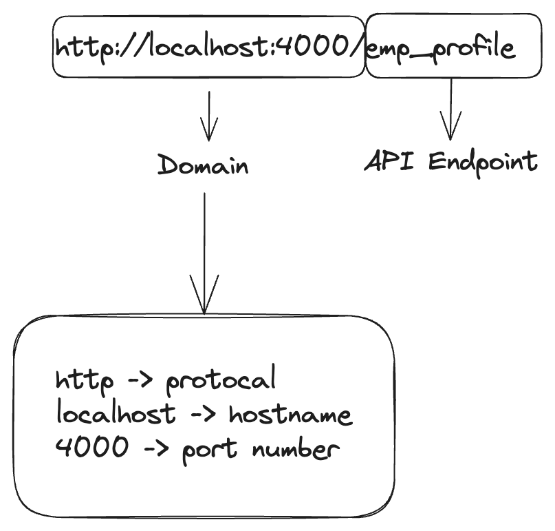
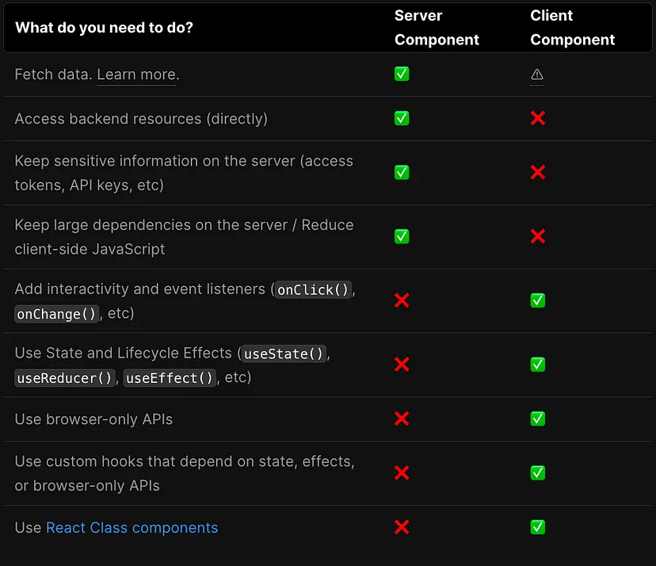

### Search Engine Optimization - SEO in Next.js

- SEO is crucial for optimizing a website's visibility and ranking in search engine results.

- Prioritizing SEO can greatly impact the success of your website and its online presence.

- You can achieve several benefits, including:
  \
  (1) Increased organic traffic
  \
  (2) Enhanced user experience
  \
  (3) Credibility and trustworthiness
  \
  (4) Competitive advantage

#### How do search engines work?

Search engines work three primary functions:

(1) Crawling
\
(2) Indexing
\
(3) Ranking

#### What is search engine crawling?

#### (1) Crawling

- the discovery process or the discovery of pages and links that lead to more pages
- send out a team of robots (known as crawlers or spiders) to find new and updated content
- Content can vary: it could be a webpage, an image, a video, a PDF, etc..; but regardless of the format, content is discovered by links

#### What is a search engine index?

#### (2) Indexing

- storing, analyzing, and organizing the content and connections between pages
- a part of a normal search engine process
- it makes sure people who are looking for information about your website or business can find your content

#### What is a search engine ranking?

#### (3) Ranking

- content's position on the search engine results pages (SERPs)
- it makes your website more visible

---

### API Endpoint

---

### Server Components vs Client Components in Next.js 13

- there are two environments where your application code can be rendered the client and the server

- server components are the default

- you need to add "use client" directive on top of the components you want to use as client components

- recommends using server components until you need to use client components

- state or hooks like useState(), useEffect(), useContext() or other client-side management solutions are only available on the client-side component

- to access browser-related things, like onClick events , window or browserAPI, you need to use the client component

  

---

### Routing in Next.js 13

- use file-based routing system which means that the routing is handled by the file system

- each folder in the app or page directory becomes a route and the folder name becomes the route's path

- no need for external packages or complex configurations

#### Dynamic Routes

- when you don't know the exact segment names ahead of time and want to create routes from dynamic data, you can use Dynamic Segments that are filled in at request time or prerendered at build time

- can be created by wrapping a folder's name in square brackets: [folderName] for example, [id] or [slug]

---

### Data Fetching

Next.js provides 3 choices for selecting how to fetch data;

1. Server Side Rendering (SSR)
2. Static Site Generation (SSG)
3. Incremental Static Generation (ISR)

#### 1. Server Side Rendering (SSR)

- Dynamic Rendering
- the content is always up to date
- don't store data, just call

#### 2. Static Site Generation (SSG)

- by default, next.js uses SSG
- automatically fetch data
- ideal for content that doesn't change frequently such as blog posts, documentation or marketing pages

#### 3. Incremental Static Generation (ISR)

- to create or update static pages
- combines the benefits of SSR and SSG for dynamic content in static sites

---

### Metadata

- Data about data

- Metadata is the abstract of the website's content and is used to attach a title, a description, and an image to the site.

- We can define Metadata in two ways: Static and Dynamic.
